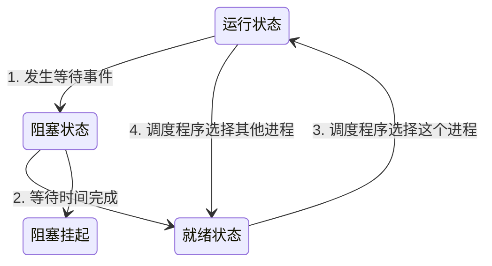

## 进程
### 什么是进程
代码=编译后==>二进制的可执行文件
当我们运行这个可执行文件后，它会被装载到内存中，接着 CPU 会执行程序中的每一条指令，那么这个运行中的程序，就被称为「进程」（Process）
### 进程的状态

描述进程没有占用实际的物理内存空间的情况，这个状态就是挂起状态
另外，挂起状态可以分为两种：

阻塞挂起状态：进程在外存（硬盘）并等待某个事件的出现；
就绪挂起状态：进程在外存（硬盘），但只要进入内存，即刻立刻运行；

### 进程的控制结构
在操作系统中，是用进程控制块（process control block，PCB）数据结构来描述进程的
PCB 是进程存在的唯一标识，这意味着一个进程的存在，必然会有一个 PCB，如果进程消失了，那么 PCB 也会随之消失。
#### PCB 包含什么
进程描述信息：

进程标识符：标识各个进程，每个进程都有一个并且唯一的标识符；
用户标识符：进程归属的用户，用户标识符主要为共享和保护服务；
进程控制和管理信息：

进程当前状态，如 new、ready、running、waiting 或 blocked 等；
进程优先级：进程抢占 CPU 时的优先级；
资源分配清单：

有关内存地址空间或虚拟地址空间的信息，所打开文件的列表和所使用的 I/O 设备信息。
CPU 相关信息：

CPU 中各个寄存器的值，当进程被切换时，CPU 的状态信息都会被保存在相应的 PCB 中，以便进程重新执行时，能从断点处继续执行。
可见，PCB 包含信息还是比较多的。
#### PCB是如何组织的
通常是通过链表的方式进行组织，把具有相同状态的进程链在一起，组成各种队列。比如：

将所有处于就绪状态的进程链在一起，称为就绪队列；
把所有因等待某事件而处于等待状态的进程链在一起就组成各种阻塞队列；
另外，对于运行队列在单核 CPU 系统中则只有一个运行指针了，因为单核 CPU 在某个时间，只能运行一个程序。


### 进程的控制
### 进程的上下文切换
#### 什么是上下文
任务是交给 CPU 运行的，那么在每个任务运行前，CPU 需要知道任务从哪里加载，又从哪里开始运行。

所以，操作系统需要事先帮 CPU 设置好 CPU 寄存器和程序计数器。

CPU 寄存器是 CPU 内部一个容量小，但是速度极快的内存（缓存）。我举个例子，寄存器像是你的口袋，内存像你的书包，硬盘则是你家里的柜子，如果你的东西存放到口袋，那肯定是比你从书包或家里柜子取出来要快的多。

再来，程序计数器则是用来存储 CPU 正在执行的指令位置、或者即将执行的下一条指令位置。

所以说，CPU 寄存器和程序计数是 CPU 在运行任何任务前，所必须依赖的环境，这些环境就叫做 CPU 上下文。
#### 什么时候回发生上下文切换
为了保证所有进程可以得到公平调度，CPU 时间被划分为一段段的时间片，这些时间片再被轮流分配给各个进程。这样，当某个进程的时间片耗尽了，进程就从运行状态变为就绪状态，系统从就绪队列选择另外一个进程运行；
进程在系统资源不足（比如内存不足）时，要等到资源满足后才可以运行，这个时候进程也会被挂起，并由系统调度其他进程运行；
当进程通过睡眠函数 sleep 这样的方法将自己主动挂起时，自然也会重新调度；
当有优先级更高的进程运行时，为了保证高优先级进程的运行，当前进程会被挂起，由高优先级进程来运行；
发生硬件中断时，CPU 上的进程会被中断挂起，转而执行内核中的中断服务程序；
### 进程间的通信方式
#### 管道
##### 管道是如何创建的
```
int pipe(int fd[2])
```
这里表示创建一个匿名管道，并返回了两个描述符，一个是管道的读取端描述符 fd[0]，另一个是管道的写入端描述符 fd[1]。注意，这个匿名管道是特殊的文件，只存在于内存，不存于文件系统中。

fork 子进程，子进程会复制父进程的文件描述符

在 shell 里面执行 A | B命令的时候，A 进程和 B 进程都是 shell 创建出来的子进程，A 和 B 之间不存在父子关系，它俩的父进程都是 shell


## 线程
### 什么是线程
同一个进程内多个线程之间可以共享代码段、数据段、打开的文件等资源，但每个线程各自都有一套独立的寄存器和栈，这样可以确保线程的控制流是相对独立的。
### 为什么使用线程
为了解决xx 2. 提高资源的使用效率 的问题

那到底如何解决呢？需要有一种新的实体，满足以下特性：

实体之间可以并发运行；
实体之间共享相同的地址空间；
### 什么是线程
### 线程与进程的比较
进程是资源（包括内存、打开的文件等）分配的单位，线程是 CPU 调度的单位；
进程拥有一个完整的资源平台，而线程只独享必不可少的资源，如寄存器和栈；
线程同样具有就绪、阻塞、执行三种基本状态，同样具有状态之间的转换关系；
线程能减少并发执行的时间和空间开销；
### 线程的上下文切换
### 线程的实现
## 调度
### 调度时机
### 调度原则
### 调度算法


## 资料
[小林coding](https://xiaolincoding.com/os/4_process/process_commu.html#%E7%AE%A1%E9%81%93)