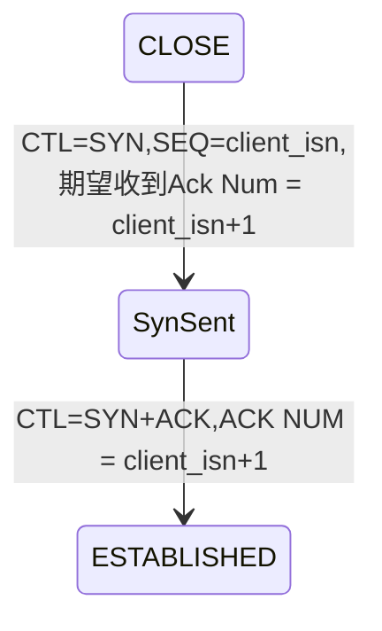
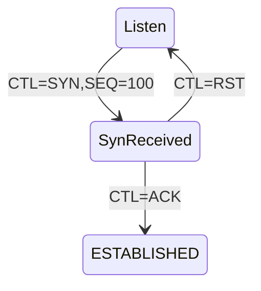
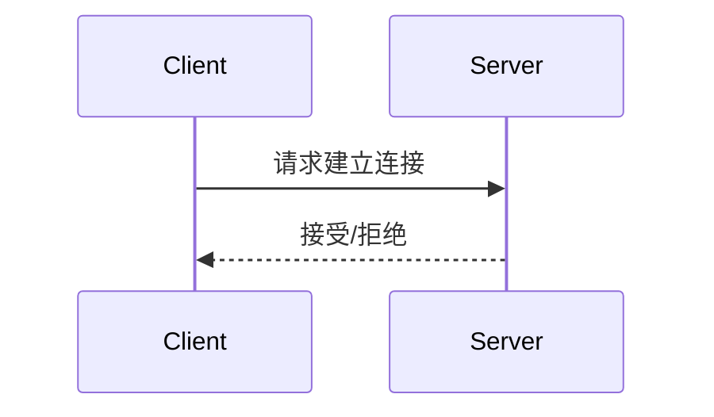

## 什么是TCP
TCP 是面向连接的、可靠的、基于字节流的传输层通信协议。

* 面向连接：一定是「一对一」才能连接，不能像 UDP 协议可以一个主机同时向多个主机发送消息，也就是一对多是无法做到的；

* 可靠的：无论的网络链路中出现了怎样的链路变化，TCP 都可以保证一个报文一定能够到达接收端；

* 字节流：消息是「没有边界」的，所以无论我们消息有多大都可以进行传输。并且消息是「有序的」，当「前一个」消息没有收到的时候，即使它先收到了后面的字节，那么也不能扔给应用层去处理，同时对「重复」的报文会自动丢弃。

> 粘包关系最大的就是基于字节流这个特点,字节流可以理解为一个双向的通道里流淌的数据，这个数据其实就是我们常说的二进制数据，简单来说就是一大堆 01 串。这些 01 串之间没有任何边界

## 为什么说TCP是可靠的
因为TCP能“克服”网络包丢失及乱序的问题

## 为什么需要 TCP 协议
TCP工作在应用层之下，IP层之上
IP 层是"不可靠"的，它不保证网络包的交付、不保证网络包的按序交付、也不保证网络包中的数据的完整性。
因此如果需要保障网络数据包的可靠性，那么就需要由上层（传输层）的 TCP 协议来负责。

## TCP格式
源端口和目的端口的字段（16位）:在 TCP 头部中，作用是告诉 TCP 协议应该把报文发给哪个进程。

> 源地址和目的地址的字段（32位）是在 IP 头部中，作用是通过 IP 协议发送报文给对方主机

序列号：在建立连接时由计算机生成的随机数作为其初始值，通过 SYN 包传给接收端主机，每发送一次数据，就「累加」一次该「数据字节数」的大小。用来解决网络包乱序问题。
> 序列号生成规则:

确认应答号：指下一次「期望」收到的数据的序列号，发送端收到这个确认应答以后可以认为在这个序号以前的数据都已经被正常接收。用来解决丢包的问题。

控制位：
* ACK：该位为 1 时，「确认应答」的字段变为有效，TCP 规定除了最初建立连接时的 SYN 包之外该位必须设置为 1 。
* RST：该位为 1 时，表示 TCP 连接中出现异常必须强制断开连接。
* SYN：该位为 1 时，表示希望建立连接，并在其「序列号」的字段进行序列号初始值的设定。
* FIN：该位为 1 时，表示今后不会再有数据发送，希望断开连接。当通信结束希望断开连接时，通信双方的主机之间就可以相互交换 FIN 位为 1 的 TCP 段。

## 什么是TCP连接

TCP的连接是用于**保证可靠性和流控制机制的信息**，包括

* **Socket**：由IP地址和端口号组成
* **序列号**：用来解决乱序问题等
* **窗口大小**：用来做流量控制

唯一确定一个TCP连接的四元组：
<源地址,源端口,目的地址,目的端口>

## TCP建立连接

### 客户端状态变化

### 服务端状态变化

### 为什么要三次握手建立连接？
我们首先设想一下两次握手建立连接的的模式是怎样的：

我们发现如果TCP建立连接只通信两次，那么接收方只能选择接受或者拒绝发送方发起的请求。
作为一个可靠的传输层协议，TCP需要在不稳定的网络环境中构建一个可靠的传输层,常见的问题有:
* 数据包被发送方多次发送造成数据的重复
* 数据包在传输的过程中丢失
* 数据包不能有序到达接收方
...

这意味着当客户端的Sync请求没有得到响应时，客户端
这意味着当发送方多次请求时，接收方需要建立多个连接

这会带来什么实际问题呢？
#### 历史连接问题
如果在网络状况复杂或者较差的网络中，发送方连续发送多次建立连接的请求,而由于网络包是无序的，旧的连接请求先于新的连接请求导到服务端。然而按照我们上面设想的“两次挥手”模式，那么接收方只能选择接受或者拒绝发送方发起的请求，它并不清楚这一次请求是不是任然有效的。

所以在实际的TCP连接建立的过程中，接收方会将发送方连接请求中包含的 **序列号**+1 发送回发送方，并交由发送方来判断该请求是否有效：
* 如果当前连接已经失效，那么发送方就会直接发送 RST 控制消息中止这一次连接；
* 如果当前连接任然有效，那么发送方就会发送ACK控制消息，通信双方就会成功建立连接；

三次握手的方式将最终是否建立连接的最终控制权交给发送方，因为只有发送方有足够上下文来判断当前连接是否是错误的或者过期的，这也是TCP使用三次握手建立连接的最主要原因

### 网络包缺失或无序问题
另一个使用三次握手的重要的原因就是通信双方都需要获得一个用于发送信息的初始化序列号，作为一个可靠的传输层协议，TCP 需要在不稳定的网络环境中构建一个可靠的传输层，网络的不确定性可能会导致数据包的缺失和顺序颠倒等问题，常见的问题可能包括：

* 数据包被发送方多次发送造成数据的重复；
* 数据包在传输的过程中被路由或者其他节点丢失；
* 数据包到达接收方可能无法按照发送顺序；

为了解决上述这些可能存在的问题，TCP 协议要求发送方在数据包中加入『序列号』字段，有了数据包对应的序列号，我们就可以：

* 接收方可以通过序列号对重复的数据包进行去重；
* 发送方会在对应数据包未被 ACK 时进行重复发送；
* 接收方可以根据数据包的序列号对它们进行重新排序；

#### TCP最大连接数

在确定TCP理论上最大连接数之前，让我们回顾一下tcp四元组：
* 源地址
* 源端口
* 目的地址
* 目的端口

因此客户端和服务端的tcp最大连接数是要分开计算的
##### 客户端TCP理论最大连接数
对于客户端，由于每个TCP连接都要独占一个端口，tcp端口的数据类型是unsigned short，因此本地端口个数最大只有65536，端口0有特殊含义，不能使用，这样可用端口最多只有65535，所以在全部作为client端的情况下，最大tcp连接数为65535，这些连接可以连到不同的server ip。
##### 服务端TCP理论最大连接数
server通常固定在某个本地端口上监听，等待client的连接请求。不考虑地址重用（unix的SO_REUSEADDR选项）的情况下，即使server端有多个ip，本地监听端口也是独占的，因此server端tcp连接4元组中只有remote ip（也就是client ip）和remote port（客户端port）是可变的，因此最大tcp连接为客户端ip数×客户端port数，对IPV4，不考虑ip地址分类等因素，最大tcp连接数约为2的32次方（ip数）×2的16次方（port数），也就是server端单机最大tcp连接数约为2的48次方。

对 IPv4，客户端的 IP 数最多为 2 的 32 次方，客户端的端口数最多为 2 的 16 次方(实际为65535)，也就是服务端单机最大 TCP 连接数，约为 2 的 48 次方。

##### TCP最大连接的物理限制 
当然，服务端最大并发 TCP 连接数远不能达到理论上限，会受以下因素影响：

文件描述符限制，每个 TCP 连接都是一个文件，如果文件描述符被占满了，会发生 too many open files。Linux 对可打开的文件描述符的数量分别作了三个方面的限制：
系统级：当前系统可打开的最大数量，通过 cat /proc/sys/fs/file-max 查看；
用户级：指定用户可打开的最大数量，通过 cat /etc/security/limits.conf 查看；
进程级：单个进程可打开的最大数量，通过 cat /proc/sys/fs/nr_open 查看；
内存限制，每个 TCP 连接都要占用一定内存，操作系统的内存是有限的，如果内存资源被占满后，会发生 OOM。